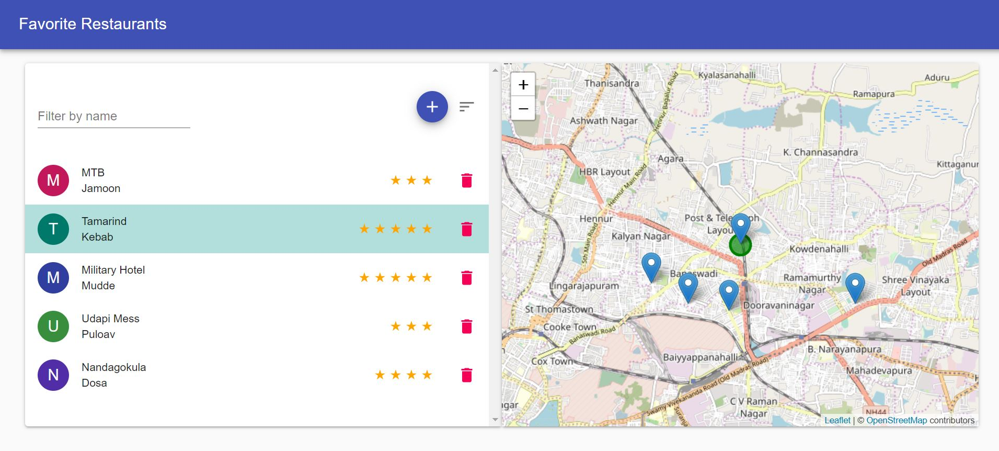
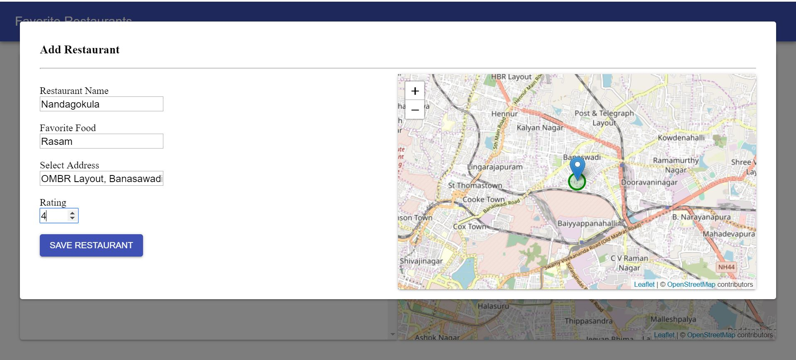

## App Demo
[DEMO](https://master.d193mnet9teo7w.amplifyapp.com/)

[<p align="center"></a></p>](https://master.d193mnet9teo7w.amplifyapp.com/)
<br/>
<p align="center"></a></p>


## System Requirement

```bash

Please use latest NODE and NPM version.

Project was built on 

node -version
v10.6.0

npm -version
6.1.0

```


## Get started

```bash

To start application

cd favoriteRestaurant
npm install
npm run start

By default server runs on [http://localhost:3000/]
Note : ( If port 3000 is blocked, Press Y to choose random port)

Allow your browser to share the location.
For best experience use chrome.
```


## User Flow

```bash

1. Restaurant view will be empty 
2. Click on + icon to add new Restaurant
3. Add Restaurant has 3 validations
    a. Name cannot be Empty or Duplicate 
    b. Name and Favorite food cannot have special characters
    C. Rating can be only bettween 0 to 5, no decimal allowed.
4. Address should be picked from the Map, if it not selected by default it takes the current location. 
5. After adding you can search, sort and delete restaurants by name
6. Click on the Map marker to highlight the rstaurant and also to center the map to the selected location.
7. Search and delete  operation on list will also filter and remove from the map also        

V2 Release 
-----------------
 1. Removed expand collapse panel and replaced with a Modal. 
    So to add restaurant click on "+" button
 2. Select Address feild is geo coded, so location can be selected by 
    a. Entering exact location 
    b. By pinning location on Map 
 3. In List view, selecting reatuarant will highlight marker in mapview with a gree circle.
 4. Code refactoting to re use mapView component.   
 5. Multiple color option for list avatars.
 
```


## Testing

```bash

NOTE : At the momemt there are failing test
npm run test 
npm test -- --coverage

```

## Tech Stack

```bash

This project is built from the starter kit created by me.
[simple-react-redux-starter-kit](https://github.com/raviprajna/simple-react-redux-starter-kit)

Starter kit was built with REBASS, but this project useses Material UI istead or REBASS

```

## Open Items

```bash
- Add unit test
- Remove inline styles
- Add Pagination for list
- Add pre-commit hook to prettify ( If you have yarn use : yarn prettier --write src/*)

```
